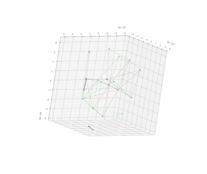

# Simulation of Crystal Lattice Formation




## Setup

```bash
# Set up a virtual env for dependencies.
python3 -m venv --prompt simclf .venv

# Activate the virtual env.
source .venv/bin/activate

# Install dependencies.
pip install --editable .
```


## Running Basic Simulation

Run the simulation

```bash
python3 -m simclf.simulations.gradient_descent
```

You should see output like this

```
...
step_number=98
step_number=99
see output in out/20260220-212840_gradient_descent_1.0
```

Then you can make an animation of the lattice formation

```bash
python3 -m simclf.tools.plot_lattice --edge-method=experimental out/20260220-212840_gradient_descent_1.0/step_00*.csv
```

<!--

## TODO

* Make some tools for analyzing the resulting crystal structure to see how "regular" it is I guess.
* Destroy basic simulation.
* Make an actual gradient descent implementation (don't tell anyone I fudged it).

-->
